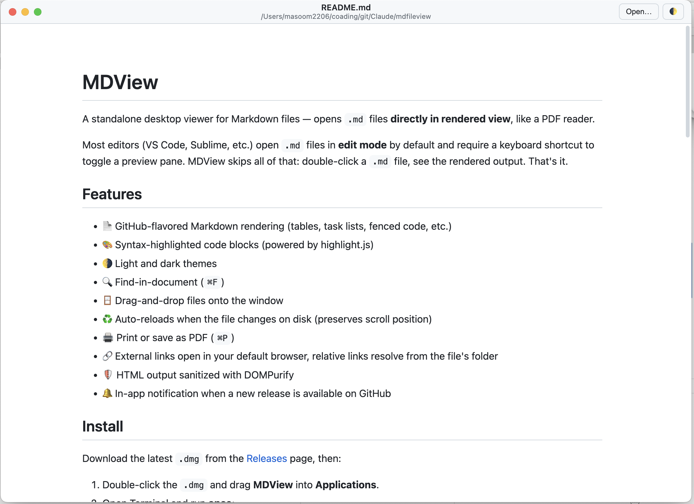

# MDView

A standalone desktop viewer for Markdown files — opens `.md` files **directly in rendered view**, like a PDF reader.



Most editors (VS Code, Sublime, etc.) open `.md` files in **edit mode** by default and require a keyboard shortcut to toggle a preview pane. MDView skips all of that: double-click a `.md` file, see the rendered output. That's it.

## Features

- 📄 GitHub-flavored Markdown rendering (tables, task lists, fenced code, etc.)
- 🎨 Syntax-highlighted code blocks (powered by highlight.js)
- 🌗 Light and dark themes
- 🔍 Find-in-document (`⌘F`)
- 🪟 Drag-and-drop files onto the window
- ♻️ Auto-reloads when the file changes on disk (preserves scroll position)
- 🖨 Print or save as PDF (`⌘P`)
- 🔗 External links open in your default browser, relative links resolve from the file's folder
- 🛡 HTML output sanitized with DOMPurify
- 🔔 In-app notification when a new release is available on GitHub

## Install

Pre-built binaries for all three desktop platforms are published on the [Releases](https://github.com/masoomaxelerant/mdview/releases) page.

### macOS (Apple Silicon and Intel)

Download the matching `.dmg`:
- `MDView-x.y.z-arm64.dmg` — Apple Silicon (M1/M2/M3/M4)
- `MDView-x.y.z.dmg` — Intel

Then:

1. Double-click the `.dmg` and drag **MDView** into **Applications**.
2. Open Terminal and run **once**:
   ```bash
   xattr -cr /Applications/MDView.app
   ```
   This is required because the build is not code-signed with an Apple Developer ID. Without this step, macOS shows *"MDView is damaged and can't be opened"* the first time you launch — see [Troubleshooting](#troubleshooting) below for the full explanation.
3. Open MDView from `/Applications` or Launchpad.

### Windows (x64)

1. Download `MDView-Setup-x.y.z.exe` from the Releases page.
2. Run the installer. If Windows SmartScreen pops up with *"Windows protected your PC"*, click **More info** → **Run anyway**. (The installer is not code-signed yet, so SmartScreen flags it as unrecognized.)
3. The installer adds MDView to your Start Menu and registers it as a handler for `.md` files.

### Linux (x64 AppImage)

1. Download `MDView-x.y.z.AppImage` from the Releases page.
2. Make it executable and run it:
   ```bash
   chmod +x MDView-*.AppImage
   ./MDView-*.AppImage
   ```
   AppImages are self-contained — no install step, no root needed. You can move the file anywhere.

## Make MDView the default `.md` opener

**macOS:**

1. Right-click any `.md` file in Finder → **Get Info**
2. Under **Open with**, pick **MDView**
3. Click **Change All…**

**Windows:** the installer registers MDView as a handler for `.md` automatically. If you want to make it the *default*, right-click any `.md` file → **Open with** → **Choose another app** → **MDView** → tick *"Always use this app"*.

**Linux:** integration depends on your desktop environment. The easiest way is to install [AppImageLauncher](https://github.com/TheAssassin/AppImageLauncher), which handles file associations on first run.

Every `.md` file now opens in MDView on double-click, exactly like a PDF.

## Keyboard shortcuts

| Shortcut | Action               |
| -------- | -------------------- |
| `⌘O`     | Open a file          |
| `⌘R`     | Reload current file  |
| `⌘F`     | Find in document     |
| `⌘P`     | Print / Save as PDF  |
| `⌘⇧T`    | Toggle light/dark    |
| `⌘+` / `⌘-` | Zoom in / out     |
| `⌘0`     | Reset zoom           |

## Development

Requirements: Node.js 18+ and npm.

```bash
git clone https://github.com/masoomaxelerant/mdview.git
cd mdview
npm install
npm start              # launch the app
npm start -- sample.md # launch with a file open
```

### Project layout

```
mdview/
├── main.js              # Electron main process (window, menus, file I/O)
├── preload.js           # IPC bridge to renderer
└── renderer/
    ├── index.html       # UI shell
    ├── styles.css       # GitHub-flavored theme (light & dark)
    └── renderer.js      # marked + DOMPurify + highlight.js pipeline
```

## Build a distributable

```bash
npm run build:mac      # macOS .dmg
npm run build:win      # Windows installer
npm run build:linux    # Linux AppImage
```

Output lands in `dist/`.

## Troubleshooting

### "MDView is damaged and can't be opened"

This message is **misleading** — the app is not actually damaged. macOS Gatekeeper shows it for any app that:

- was downloaded via a browser (browsers mark downloads with the `com.apple.quarantine` attribute), **and**
- isn't signed with an Apple Developer ID certificate.

Older macOS versions just warned about "an unidentified developer" and let you right-click → Open. Sonoma and Sequoia changed the message to "damaged" and removed the right-click bypass, even though the binary is fine.

**Fix** — once, in Terminal:

```bash
xattr -cr /Applications/MDView.app
```

This strips the quarantine flag. The app will then open normally for all future launches.

> The long-term fix is to ship a signed and notarized build, which requires an Apple Developer Program membership ($99/year). It's on the roadmap.

### Windows: "Windows protected your PC" (SmartScreen)

Same root cause as the macOS warning — the installer isn't signed with a Windows code-signing certificate, so SmartScreen flags it as unrecognized. The fix:

1. Click **More info** in the SmartScreen dialog
2. Click **Run anyway**

After the first launch, Windows remembers MDView and won't prompt again. The long-term fix is a Windows code-signing certificate, which is a separate purchase from any vendor (DigiCert, Sectigo, etc.) — also on the roadmap.

### Linux: AppImage won't run

Two common causes:

1. **Not executable** — `chmod +x MDView-*.AppImage` and try again.
2. **Missing FUSE** — AppImages need libfuse2. On Ubuntu 22.04+:
   ```bash
   sudo apt install libfuse2
   ```

## License

MIT
